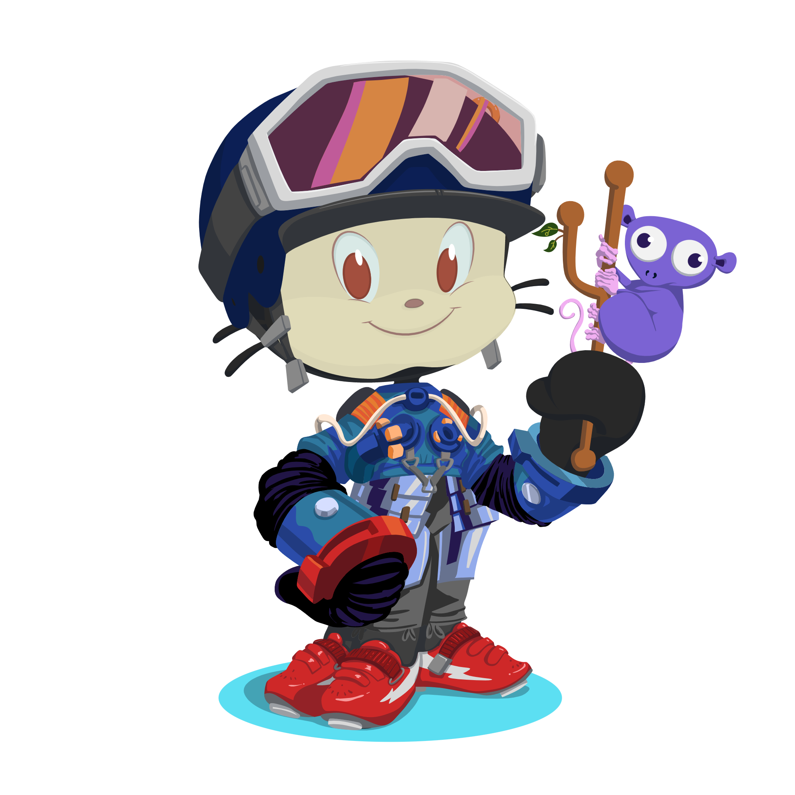

<h1 align="center">Hi 👋, I'm Avijit Biswas </h1>

<h3 align="center">A passionate ML/DL and React developer from India </h3>

-   🔭 I’m currently working on **AI fullstack development**

-   🌱 I’m currently learning **NextJS**

-   💬 Ask me about **ML/DL,React, Math or anything**

  

📫 How to reach me:innocent:

 
  &nbsp
  
  &nbsp
  
  
  

<h3 align="left">Languages and Tools:</h3>

                                

### Blogs posts

<!-- BLOG-POST-LIST:START -->
<!-- BLOG-POST-LIST:END -->
